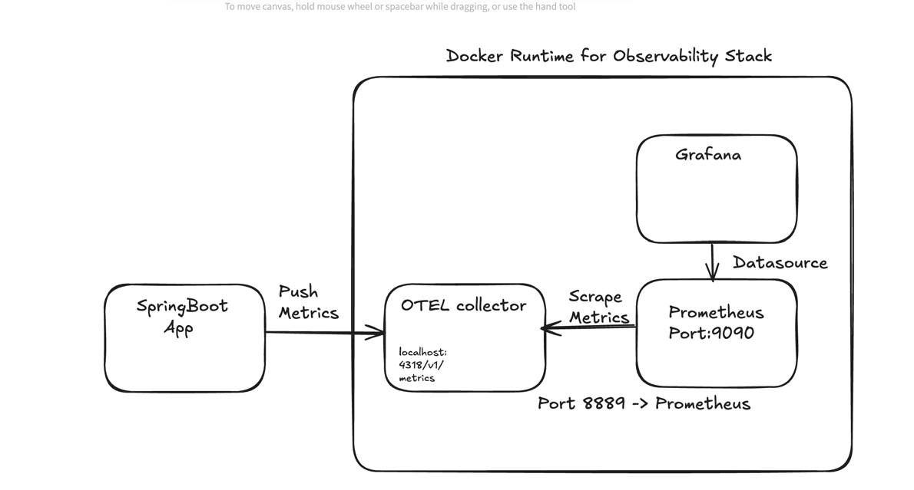

# Spring Observability

## How to run?
 - Run `docker compose up`
 - Access Prometheus at `localhost:9090`
 - Access Grafana at `localhost:3000`
 - Next connect the Prometheus as a data source in Grafana
 - Import the dashboard from `grafana/dashboards` folder with a specific dashboard id & attach the Prometheus data source to it.
 - Access the dashboard from the Grafana UI.

## Code Log
#### [Commit for integrating Prometheus & Grafana](https://github.com/varunu28/spring-playground/commit/ef31a3bff68c7e9d270ac1a71a7a81f8dd30f898)
 - We expose `localhost:<service_port>` for prometheus metrics & map it to `host.docker.internal` for prometheus to scrape metrics.
 - Prometheus config consists of:
   - `scrape_interval` & `evaluation_interval` for scraping the metrics
   - `scrape_configs` for where to scrape the metrics from

#### [Commit for integrating with OpenTelemetry]()
 - `otel-collector` is the place that receives metric data from the applications & send it to visualization tools such as Grafana. 
 - So now the application sends data to collector & then tools such as prometheus scrapes the data from collector & act as a source for visualization tools such as Grafana.
 - As Prometheus & OTEL are in same docker network, we no longer need `extra_hosts` to interface with the localhost. Prometheus is now scraping data from OTEL.
